<div align="center">


# Velm

**A Miro alternative, written in Rust.** Native, not Electron — so it stays fast on
boards that make a browser-based canvas crawl.

[](#license)
[](#platform-support)
[](https://github.com/ibrahimbisen/Velm/releases)

</div>

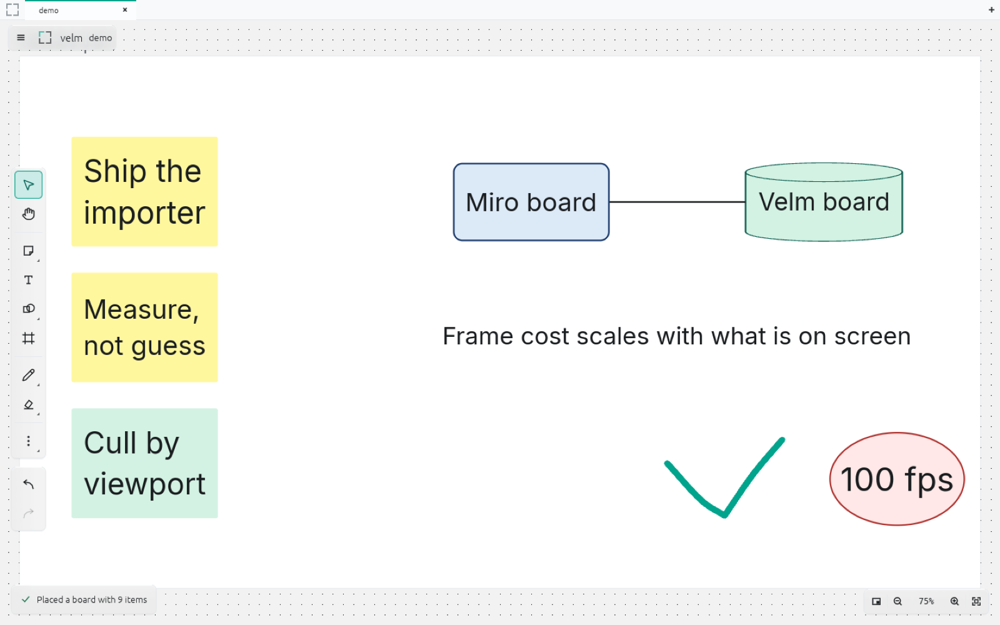

---

## Why

Miro is a web app in a desktop wrapper. It ships fourteen processes and 296 MB, and it
slows down as a board fills up. Velm draws the canvas directly on the GPU and only draws
**what is actually on screen** — so a board with a hundred thousand things on it costs
the same per frame as a board with two hundred, as long as you are only looking at two
hundred of them.

|  | Miro | Velm | |
|---|---:|---:|:--|
| **Install size** | 296 MB | **18.5 MB** | **16× smaller** |
| **Memory, board open** | 357 MB | **104 MB** | **3.4× less** |
| **Processes** | 14 | **1** | |

And what that buys, measured on Velm:

| | |
|---|---|
| A 596-item board, **every item on screen** | **100 fps**, 9.96 ms/frame, 104 MB |
| A **100,000-item** board, 233 items on screen | **100 fps**, 9.96 ms/frame, 110 MB |

100 fps is this display's refresh rate — it means no dropped frames, not a ceiling.

<details>
<summary><strong>How these were measured</strong></summary>

On one machine — an 8-core, 8 GB Apple Silicon MacBook — in August 2026.

- **Install size**: `du -sk` on `/Applications/Miro.app` against the `Velm.app` this
  repo's `scripts/make-app.sh` builds with `PROFILE=dist`. The same thing you download.
- **Memory**: Velm is one process, so `ps -o rss` is the whole story: a real 596-widget
  Miro board, imported, with every item drawn. Miro is Electron, so one PID badly
  undercounts it — the figure is the **sum of all fourteen** of its processes, in normal
  use with a board open. Both were sampled after the app had settled.
- **Frame rate**: the app's own HUD (`--hud`), averaged over a 45-second run.
- **Not claimed: a frame-rate multiple over Miro.** There is no honest way to measure
  Miro's frame rate from outside it, so Velm's numbers are given on their own.

Reproduce any of them: `./target/release/vellum-app --bench 100000 --hud --exit-after 25`.

</details>

---

## What it does

**Boards and organising** — as many boards as you like, open several at once in tabs,
sort them into folders, star the ones you use, and search across all of them at once.
Deleting a board puts it in *Recently deleted*, where it stays until you say otherwise.

**Drawing** — a pen with smoothing, an eraser that can rub out strokes or whole objects,
41 shapes including the standard flowchart symbols, and connectors that stay attached and
re-route when you move either end.

**Writing** — sticky notes, text boxes, and titles, edited directly on the canvas with a
real caret: click to place it, arrow and word motion, select a range, copy and paste
characters rather than objects. Text auto-fits its box.

**Structure** — tables, kanban boards, mind maps that lay themselves out, and bar, line
and pie charts. Double-click into any cell, card or node and type.

**Links and pictures** — paste a URL and it becomes a card with the page's title, icon
and preview image. Drop in images; they are stored once and shared between boards.

**Bringing a Miro board across** — copy a board in Miro, paste it into Velm, and it
arrives with its stickies, text, frames, images, link cards and **your pen drawings** —
which no Miro API exposes at all. Point Velm at a `.rtb` backup and it recovers the
full-resolution images too. On the reference board, 596 of 596 widgets import, 532 of
them losslessly.

**Getting work out** — PNG, PDF, SVG and CSV.

**Nice to have** — relative snapping with alignment and equal-spacing guides (loose, not
strict), a floating toolbar above whatever you select, a right-click menu, a native
macOS menu bar, and undo that groups a typed word into one step.

<details>
<summary><strong>What it deliberately does not do</strong></summary>

- **Real-time collaboration.** No presence, cursors, comments, or voting. Cut on
  purpose — this is a single-player tool.
- **Playable embeds.** A pasted YouTube link becomes a card with the poster and a play
  button that opens your browser. A live embed needs a whole browser engine per card
  (60–150 MB idle), and it could not zoom, be occluded by a frame, or export.
- **Dark mode.** Light only. The tokens exist and are tested, but nothing selects them.
- **Rendering PDFs.** The bytes are stored; nothing draws the pages yet.

</details>

---

## Screenshots

|  |  |
|---|---|
| 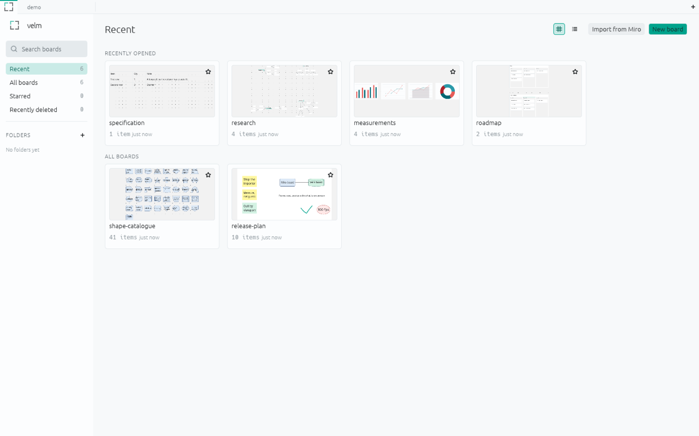<br>**Your boards** — recent, starred, folders, and a trash that does not expire | 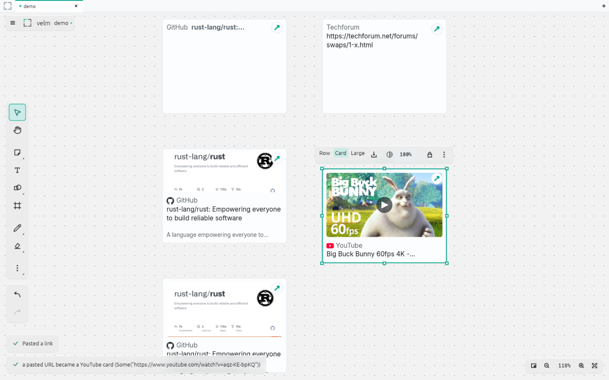<br>**Link cards** in three sizes, with the toolbar that floats above a selection |
| 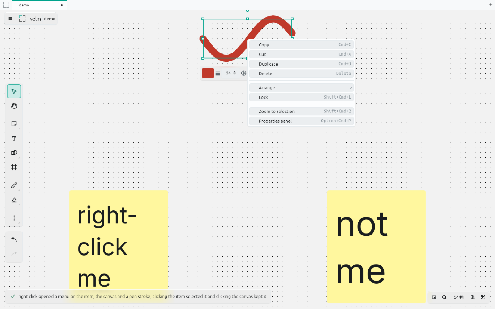<br>**Right-click anything** — the same commands as the menu bar, where your hand is | 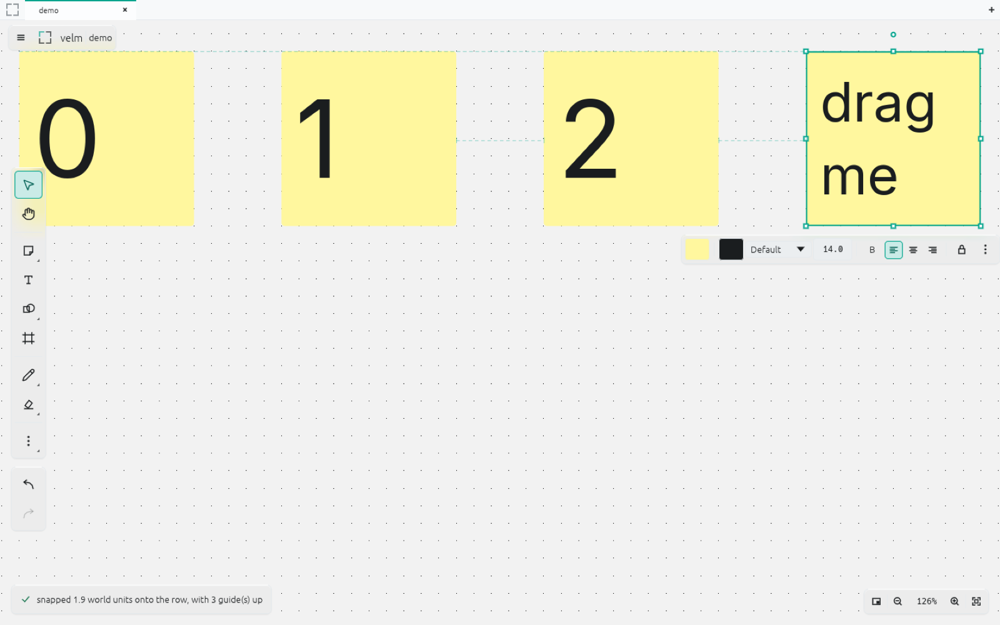<br>**Snapping** that suggests rather than insists, with equal-spacing hints |

<details>
<summary><strong>More — shapes, tables, charts, mind maps, kanban, the properties panel</strong></summary>

| | |
|---|---|
| 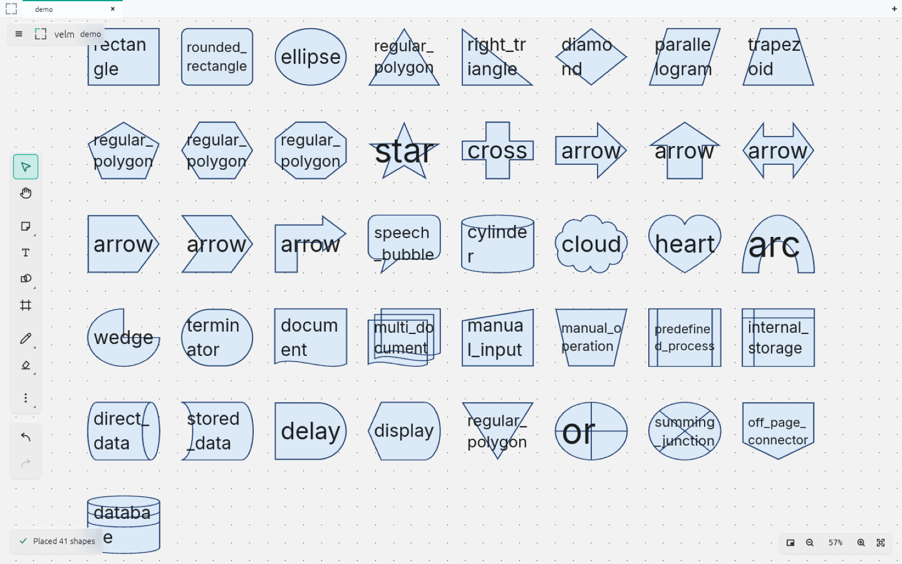 | 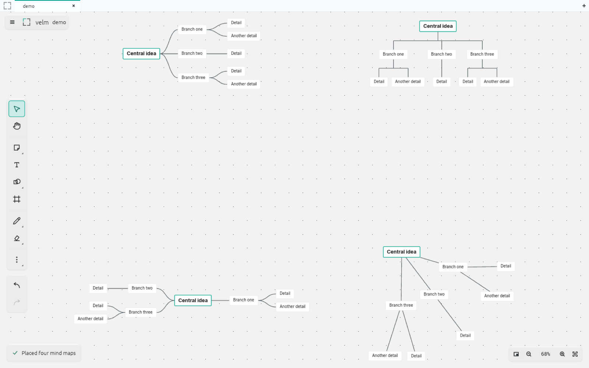 |
| 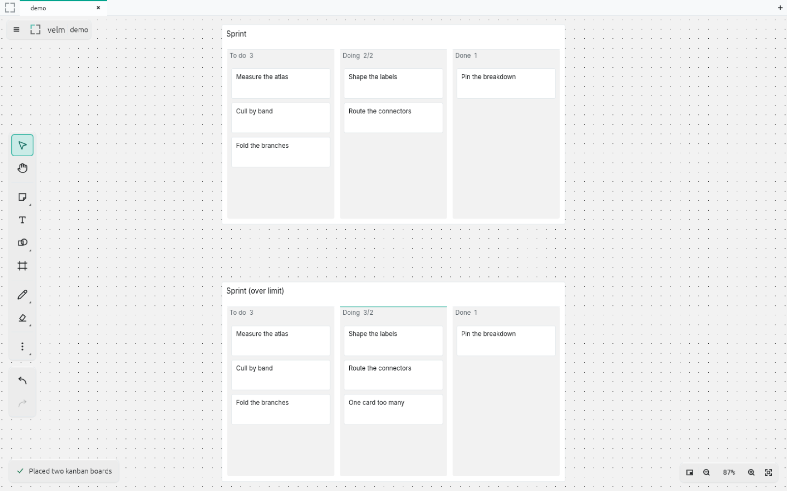 | 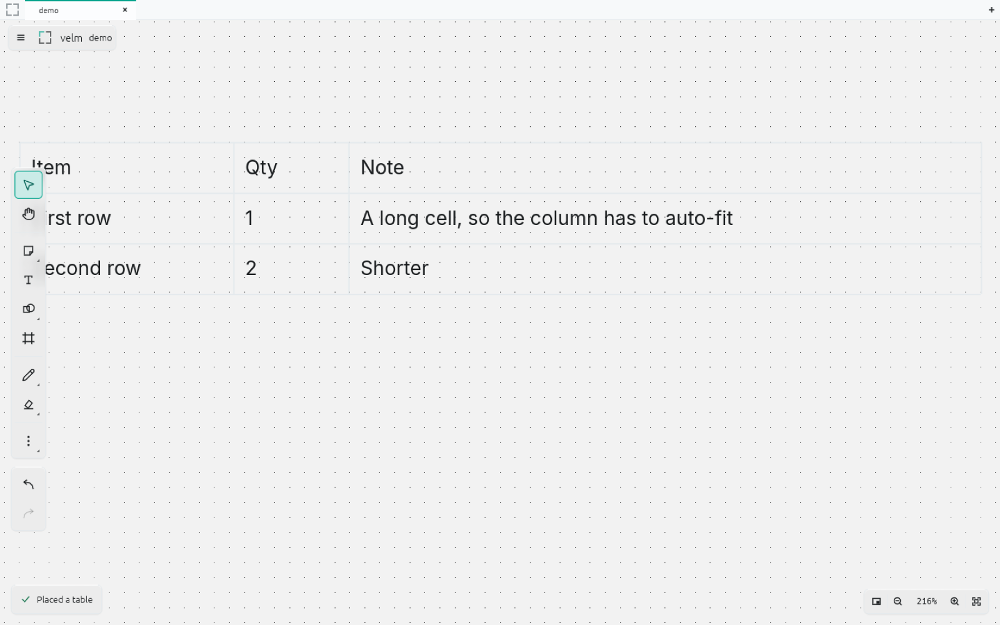 |
| 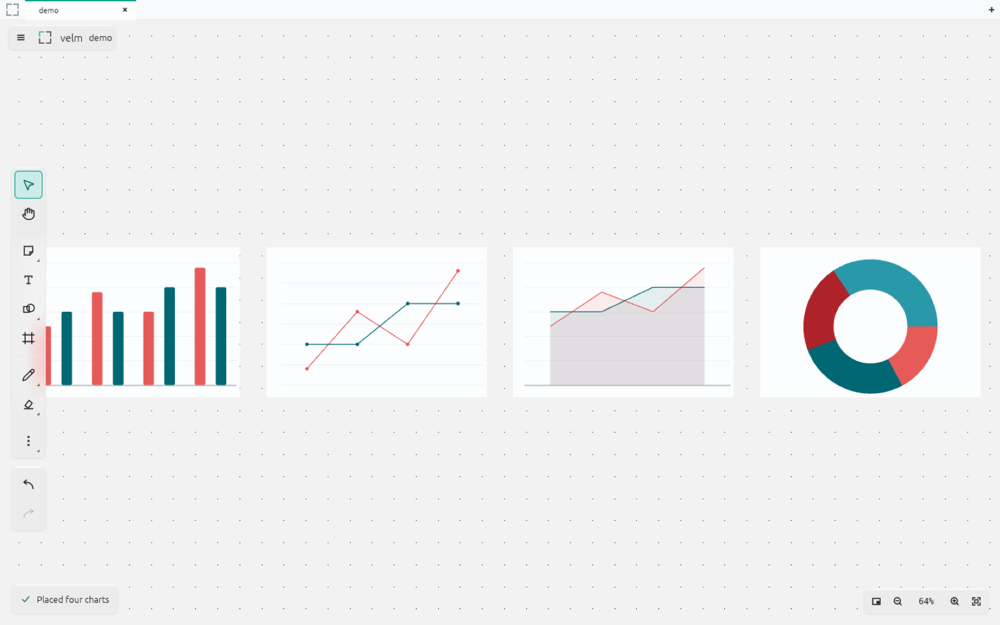 | 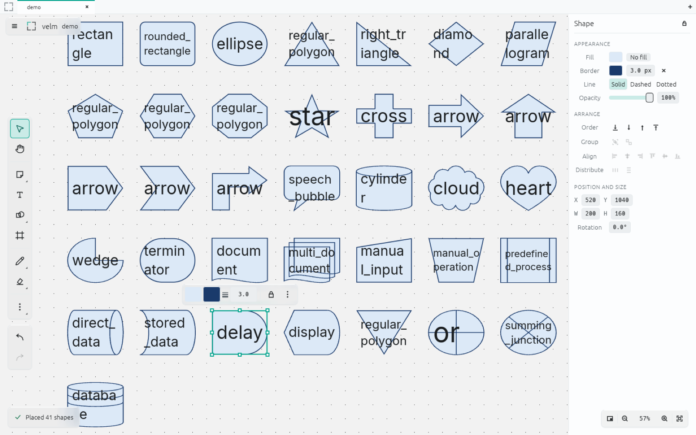 |

Every one of these is a fixture you can produce yourself:
`./target/release/vellum-app --demo kanban`. See `scripts/screenshots.sh`.

</details>

---

## Platform support

| Platform | Status |
|---|---|
| **macOS 11+ · Apple Silicon** | ✅ **Supported** — download the release, or build from source |
| macOS 11+ · Intel | ⚙️ Build from source. The code targets it; no binary is published and it is untested |
| Windows 10/11 | 🚧 Planned. `winit` and `wgpu` are portable, but Velm has never been built or tested there |
| Linux | ❌ Not planned |

---

## Install

### Download it

1. Get the latest **`Velm-<version>-macos-arm64.dmg`** from
   [Releases](https://github.com/ibrahimbisen/Velm/releases).
2. Open it and drag **Velm** into your Applications folder.
3. Double-click it. That is the whole of it — every release is signed with an Apple
   Developer ID and notarized by Apple, so there is no Gatekeeper warning and nothing
   to allow in System Settings.

Apple Silicon only. Releases before 1.2.0 were ad-hoc signed and will still ask you to
approve them under **System Settings ▸ Privacy & Security**.

Your boards live in `~/Library/Application Support/Vellum/`. Nothing is sent anywhere;
there is no account and no sync.

### Build it yourself

Needs a [Rust toolchain](https://rustup.rs) and the Xcode command line tools.

```bash
git clone https://github.com/ibrahimbisen/Velm.git
cd Velm

cargo build --release        # ~2 minutes cold
./target/release/vellum-app  # run it

./scripts/make-app.sh        # or make a real Velm.app on your Desktop
```

For a build to give someone else, use the shipping profile — fat LTO, a smaller binary,
and about four and a half minutes:

```bash
PROFILE=dist ./scripts/make-app.sh /Applications
```

### Releases

Every push to `main` that passes CI cuts one, with no manual step: the minor version is
bumped in `[workspace.package]`, tagged, built with the shipping profile, signed with a
Developer ID under the hardened runtime, notarized by Apple, stapled, wrapped in a DMG
and published. `.github/workflows/ci.yml` is the whole of it; put `[skip release]` in a
commit message to push without cutting one.

The version is written in exactly one place — `[workspace.package] version` in the root
`Cargo.toml`. `scripts/make-app.sh` stamps `Info.plist` from it and the About dialog
reads `env!("CARGO_PKG_VERSION")`, so they cannot disagree.

Signing needs six repository secrets. A fork will not have them, and the release job
fails on the first step naming the ones it is missing rather than part-way through:

| Secret | What it is |
| --- | --- |
| `MACOS_CERT_P12` | base64 of a Developer ID Application certificate exported as `.p12` |
| `MACOS_CERT_PASSWORD` | the password that `.p12` was exported with |
| `MACOS_SIGN_IDENTITY` | e.g. `Developer ID Application: Name (TEAMID)` |
| `APPLE_API_KEY_P8` | base64 of an App Store Connect API key (`.p8`) |
| `APPLE_API_KEY_ID` | that key's Key ID |
| `APPLE_API_ISSUER_ID` | that key's Issuer ID |

`scripts/sign-release.sh` does the signing half and runs by hand too. With no API key in
the environment it signs, verifies and builds the DMG but skips notarization, which is
the way to check that the hardened runtime has not broken anything before pushing.

---

## Colours

Velm's palette. The neutrals are only about 4% apart in luminance on purpose: hierarchy
comes from type, spacing and hairlines, not from slabs of contrasting grey.

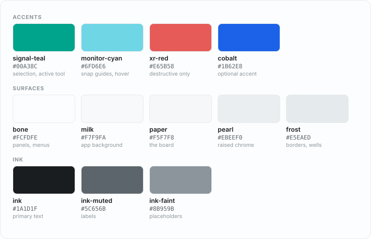

The mark is four corner brackets around a frame that is never drawn — a bounded view onto
something with no edges, and exactly what a selection looks like on the canvas. It wears
whichever accent you pick in **Preferences ▸ Accent colour**:

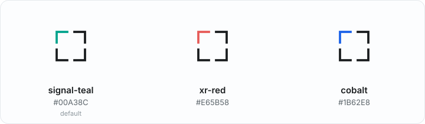

Three fixed choices rather than a colour picker, because each one has to stay legible
twice — text on the accent, and text on the accent's own pale tint, both at 4.5:1. An
arbitrary hue cannot promise that. (Charcoal on the teal is 5.3:1 and white is 3.2:1; on
the cobalt those swap, which is why the text colour is derived rather than fixed.)

Full reasoning in [`docs/05-design-language.md`](docs/05-design-language.md).

---

## Documentation

| | |
|---|---|
| [**RULES.md**](RULES.md) | Read before changing anything. Rule Zero, the settled decisions, and thirteen traps that each cost real debugging |
| [**CONTRIBUTING.md**](CONTRIBUTING.md) | How to send a pull request that lands |
| [`docs/01-architecture.md`](docs/01-architecture.md) | Why native, why no webview, and where the frame budget goes |
| [`docs/02-miro-formats.md`](docs/02-miro-formats.md) | Miro's clipboard, `.rtb` and SVG formats, reverse-engineered and measured |
| [`docs/04-ui-reference.md`](docs/04-ui-reference.md) | Miro's real layout and shortcuts, so your hands already know where things are |
| [`docs/05-design-language.md`](docs/05-design-language.md) | The palette, the glass material, and the anti-generic-design rules |
| [`docs/08-web.md`](docs/08-web.md) | The browser client and the server it talks to: twenty-one routes, and which nine of them write |
| [`docs/09-hosting.md`](docs/09-hosting.md) | Run your own server, so your boards reach any browser you open |
| [`docs/features/README.md`](docs/features/README.md) | The full parity catalogue — about 120 rows, honest about the gaps |

Built as eighteen crates: the document is a [Loro](https://loro.dev) CRDT (for undo and
history, not for collaboration), storage is SQLite per board plus a BLAKE3-addressed blob
store, the canvas is [wgpu](https://wgpu.rs), text is
[cosmic-text](https://github.com/pop-os/cosmic-text), and the chrome is
[egui](https://egui.rs) drawn through Velm's own renderer.

## License

MIT ([LICENSE-MIT](LICENSE-MIT)) or Apache-2.0 ([LICENSE-APACHE](LICENSE-APACHE)), at
your option. Bundled Inter is under the SIL Open Font License
([`assets/fonts/Inter-LICENSE.txt`](assets/fonts/Inter-LICENSE.txt)).

Velm is not affiliated with Miro. "Miro" is a trademark of its owner and is used here
only to describe compatibility.
